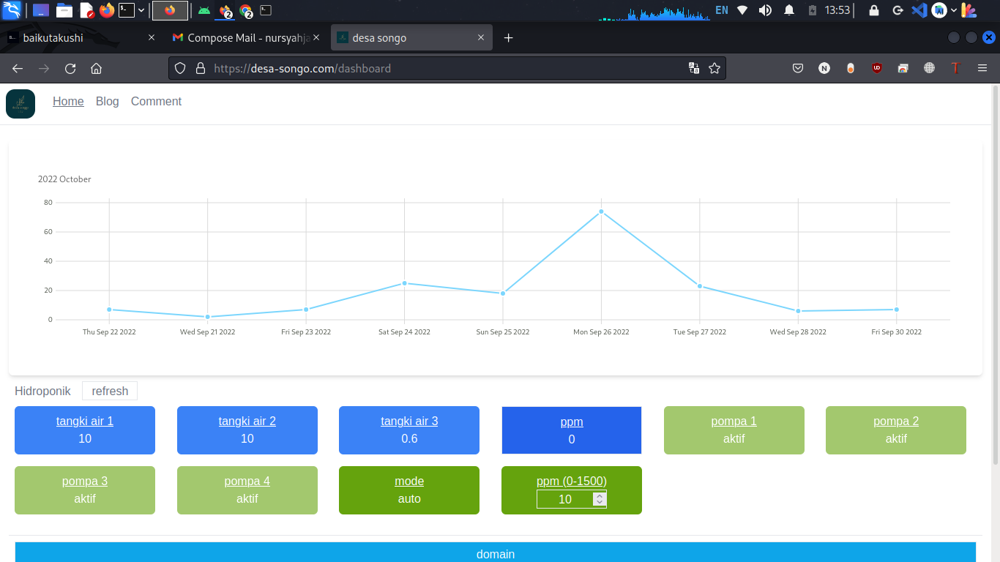
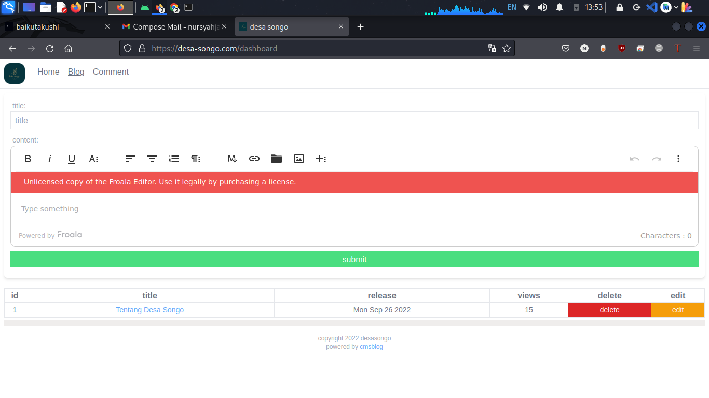

# cmsblog

[](https://app.netlify.com/sites/desasongo/deploys)

this cmsblog use template [vue supabase template](https://github.com/nursyah21/vue-supabase-template)


## user guide
edit landing page in [`src/views/Index.vue`](src/views/Index.vue)
for home page you can edit [`src/components/Home.vue`](src/components/Home.vue)
you can also edit admin page in [`src/views/Dashboard.vue`](src/views/Dashboard.vue)

you can deploy this website in [netlify](https://netlify.com) and thanks to [supabase](https://supabase.com) we can create cms like wordpress but with minimalize code and written in vue, ts, js.

<details><summary>`database` you can use <a href='https://github.com/vuerd/vuerd/tree/master/packages/vuerd-vscode'>vuerd</a> to open `erd.vuerd` to see schema database and generate sql</summary>

blog: 
- blog_id:int4
- data:text
- release:text
- views:int4
- link:text
- preview_data:text

comment:
- comment_id:int4
- name:text
- comment:text
- created_at:text
- url_blog:text
	
hidroponik:
- id_hidroponik:int4
- tangki1:float8
- tangki2:float8
- tangki3:float8
- tds:float8
- pompa_1:bool
- pompa_2:bool
- pompa_3:bool
- pompa_4:bool
- ppm:int4
- auto:bool
	
shop:
- shop_id:int4
- name:text
- url:text
- price:text
- img_url:text
	
users:
- users_id:int4
- name:text
- pass:text
- created_at:text
	
visited:
- visited_id:int4
- time:text
- counts:int4
</details>

to login in admin mode juat open `/login`

if you find bug, please open an [issue](https://github.com/nursyah21/cmsblog/issues)

website using this cmsblog: desa-songo.com

### getting started
```bash
git clone https://github.com/nursyah21/cmsblog <your-project>
cd <your-project>
npm install

npm run dev
```

don't forget to fill [.env](.env) based on your supabase

you can also delete unnecessary feature like hidroponik, just hidden it


screenshot website:







